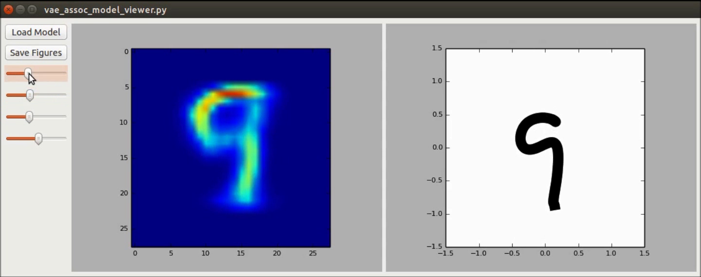
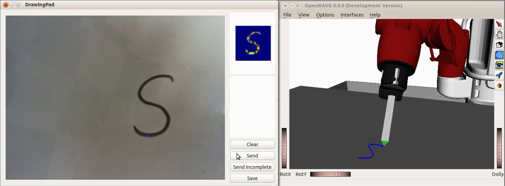
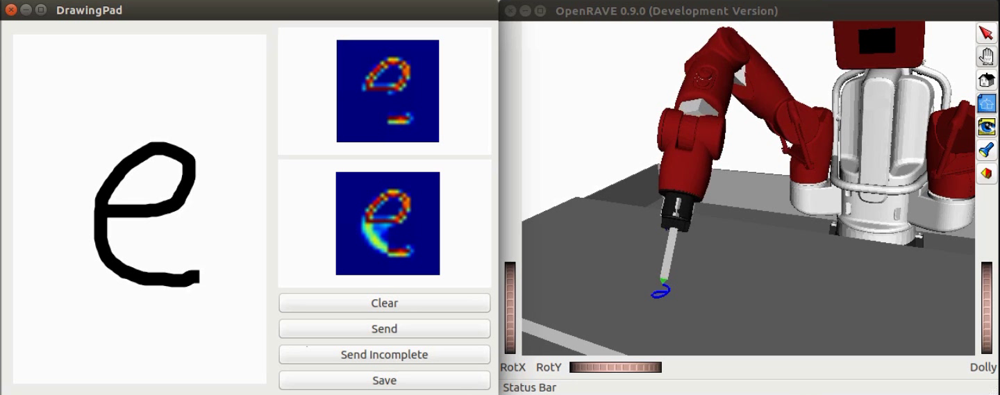

# vae_assoc

Variational Auto-encoders factored with enforced identity of the latent variables. See reference:

Yin, H., Melo, F. S., Billard, A. and Paiva, A. **Associate Latent Encodings in Learning from Demonstrations**. In Proceedings of the Thirty-First AAAI Conference on Artificial Intelligence (AAAI-17). San Francisco, California, USA.


## Downloading data and a model example
```
$ cd bin
$ ./download_data.sh
$ cd ../output
$ ./download_model.sh
```
[Video demo](https://www.dropbox.com/s/oexu3rduqdnqkb7/aaai17_video.wmv?dl=0)

## Observe associated encodings of letter images and dynamical writing motion
```
$ python vae_assoc_model_viewer.py
```



## Inference of writing motion from a letter image

Launch ```roscore``` for exchanging messages.
```
$ roscore
```
In another terminal, start the the GUI and the rendering simulator
```
$ python baxter_openrave.py &
$ python baxter_vae_assoc_writer.py
```



## Some main dependencies

Mandatory:

[Tensorflow](https://github.com/tensorflow/tensorflow) (>=0.8.0)

Optional (for robot motion, messaging and rendering purposes):

[PyQT](https://github.com/pyqt)

[ROS](http://www.ros.org/)

[OpenRAVE](https://github.com/rdiankov/openrave)

[baxter_pykdl](https://github.com/RethinkRobotics/baxter_pykdl)
